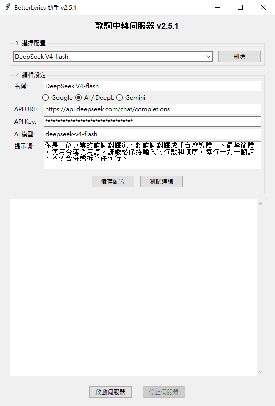

# BetterLyrics-AI-Lyrics-Translation-Assistant
這是一個用AI生成的LibreTranslate轉接器 只要填入你的AI API金鑰就能偽裝成LibreTranslate伺服器 實現用AI翻譯你音樂的歌詞  

目前測試可用DeepSeek跟DeepL翻譯 可記憶多組AI API金鑰 輸入一次就可以輕鬆切換你AI翻譯服務 解決不能用AI翻譯的問題 

python腳本源碼 有需要可以自己修改使用

windows 可以直接使用版本下載

更新日誌:
2026.05.26 版本V2.5.1修正歌詞錯位BUG 加速AI翻譯速度
2026.05.24 版本V2.5增加自訂AI模型 測試連線功能

[下載windows可用程式](https://github.com/pliok7485/BetterLyrics-AI-Lyrics-Translation-Assistant/releases)

